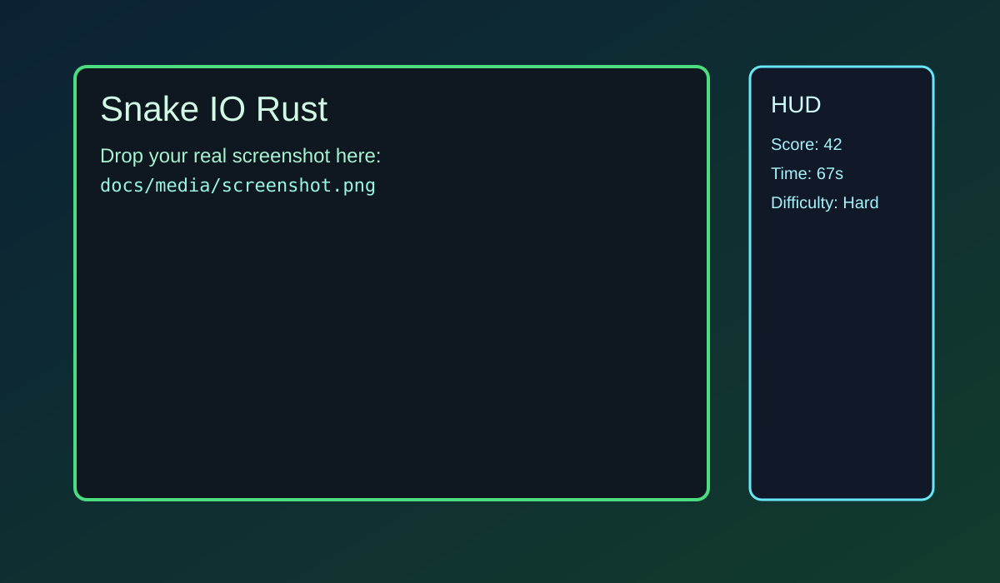
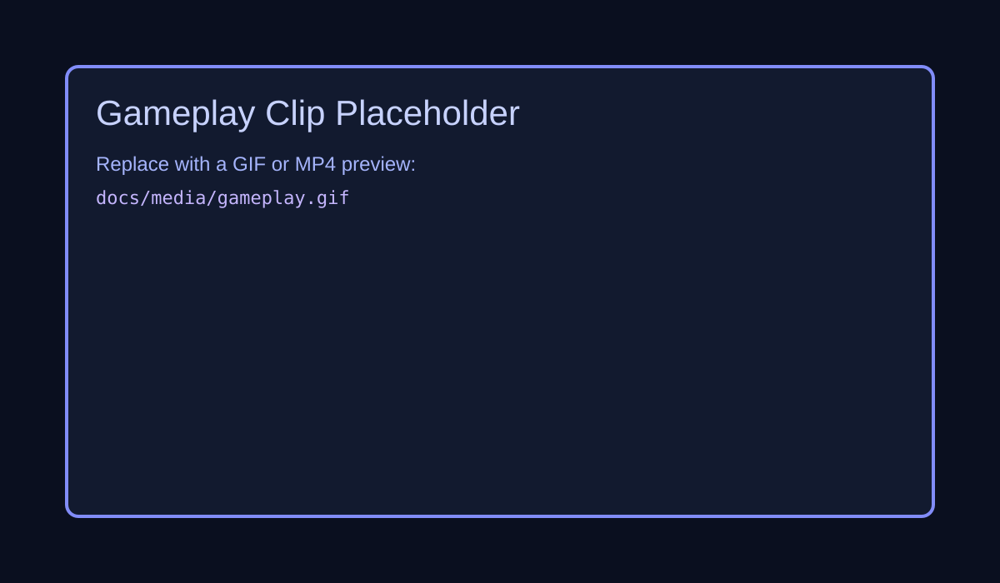

# Snake IO Rust

[](https://github.com/sj30798/snake_io_rust/actions/workflows/ci.yml)

A Bevy-based Snake IO game written in Rust, with modular game/app systems and automated tests.

## Media

### Screenshot



### Gameplay Preview



To use your real media:

1. Add a screenshot at docs/media/screenshot.png.
2. Add a clip at docs/media/gameplay.gif.
3. Replace the image links above with those filenames.

## Run

```bash
cargo run --release
```

## Controls

### Menu

- 1: Start Easy
- 2: Start Normal
- 3: Start Hard

### In Game

- Arrow keys: Move player snake
- Q or Esc: End current round and return to menu

## Architecture

- src/main.rs: App entry point and window/plugin setup.
- src/app/mod.rs: Bevy plugin composition and app-level integration tests.
- src/app/state.rs: Shared app resources and game states.
- src/app/components.rs: ECS marker components for rendering/UI cleanup.
- src/app/systems/menu.rs: Camera and menu input/overlay systems.
- src/app/systems/gameplay.rs: Game lifecycle, input, simulation update, and cleanup.
- src/app/systems/render.rs: Board, snakes, fruit, and HUD rendering.
- src/game/core.rs: Core Game struct and round/timing logic.
- src/game/world.rs: Snake/fruit spawning and world updates.
- src/game/collisions.rs: Collision and snake-vs-snake resolution.
- src/game/ai.rs: Bot steering and local path decisions.
- src/game/types.rs: Shared domain types/constants and snake behavior primitives.

## Test

```bash
cargo test
```

## Development Workflow

Recommended local loop before opening a PR:

1. Format code.
2. Run lints with warnings denied.
3. Run full tests.
4. Launch the game to sanity-check gameplay/UI.

```bash
cargo fmt --all
cargo clippy --all-targets --all-features -- -D warnings
cargo test --all-targets --all-features
cargo run --release
```

## Quality Checks

```bash
cargo fmt --all -- --check
cargo clippy --all-targets --all-features -- -D warnings
```

## Troubleshooting

### cargo run --release fails once, then works

This can happen after dependency/toolchain updates or interrupted incremental builds.

```bash
cargo clean
cargo check
cargo run --release
```

### Blank window or no visible board

1. Update graphics drivers on Windows.
2. Close overlays that hook rendering (screen recorders/OSD tools).
3. Rebuild fresh:

```bash
cargo clean
cargo run --release
```

### clippy or fmt command not found in CI/local

Install missing Rust components:

```bash
rustup component add rustfmt clippy
```

### CI passes locally but fails on GitHub

Run the exact CI sequence locally from repo root:

```bash
cargo fmt --all -- --check
cargo check --all-targets
cargo clippy --all-targets --all-features -- -D warnings
cargo test --all-targets --all-features
```
